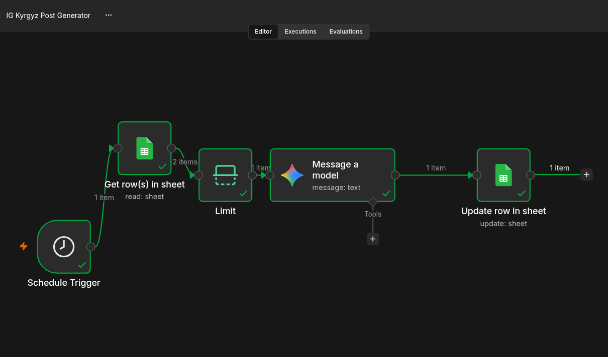

# IG Kyrgyz Post Generator (n8n)

An n8n workflow that writes a daily Instagram caption in **Kyrgyz** for my early years education page. Every morning it takes the next topic from a Google Sheet, asks Google Gemini to write a short, warm post for parents of young children, and writes the result back to the sheet, ready for me to review and publish.



## How it works

```
Schedule Trigger → Get row(s) in sheet → Limit → Gemini: Message a model → Update row in sheet
```

| Node | What it does |
|---|---|
| **Schedule Trigger** | Runs once a day at 10:00 (Asia/Dubai). |
| **Get row(s) in sheet** | Reads all rows where `status = new`. |
| **Limit** | Keeps only the first row, so exactly one post is written per run. |
| **Message a model (Gemini)** | Sends the topic with a prompt and returns a Kyrgyz caption (80–120 words, one home activity, emojis, Kyrgyz hashtags). |
| **Update row in sheet** | Writes the post and a timestamp into the same row (matched on `row_number`) and sets `status` to `ready to publish`. |

The sheet works as a simple **content queue**: add topics with status `new`, and the workflow processes one per day without ever repeating a topic.

### Sheet structure

| topic | status | post | generated_at |
|---|---|---|---|
| colors for 3-year-olds | new | | |

See [`sample-sheet.csv`](sample-sheet.csv) for a template.

## Design decisions

- **Gemini for Kyrgyz.** Kyrgyz is a low-resource language. I compared models and chose Gemini Flash because it produced the most natural Kyrgyz, and its free tier easily covers one request per day.
- **Human in the loop.** Posts are marked `ready to publish`, not published automatically. As a native speaker I review each one before it goes live, since AI output in Kyrgyz still needs checking.
- **Referencing earlier nodes.** After the Gemini node, `$json` only contains the model's response. The update step gets `row_number` and `topic` from the Limit node with `$('Limit').item.json...` so it writes to the correct row.
- **Bug found in testing.** On the first end-to-end run, the update step erased the `topic` column, because an empty mapped field is written as an empty value. Fixed by mapping the original topic back explicitly.

## Setup

1. Run n8n locally with Docker (a volume keeps workflows and credentials; the timezone makes the schedule use local time):

   ```bash
   docker volume create n8n_data
   docker run -it --rm --name n8n -p 5678:5678 \
     -e GENERIC_TIMEZONE="Asia/Dubai" -e TZ="Asia/Dubai" \
     -v n8n_data:/home/node/.n8n \
     docker.n8n.io/n8nio/n8n
   ```

2. Create a Google Sheet with the columns above.
3. In Google Cloud, create an OAuth client (Web application) with the redirect URI `http://localhost:5678/rest/oauth2-credential/callback`, and enable the Google Sheets and Google Drive APIs.
4. Get a Gemini API key from Google AI Studio.
5. In n8n, import `workflow.json`, then:
   - connect your Google Sheets and Gemini credentials in each node,
   - select your sheet in both Sheets nodes (replacing `YOUR_SHEET_ID`).
6. Run **Execute workflow** to test, then **Publish**.

## Example output

> Кымбаттуу ата-энелер, үч жаштагы наристе үчүн түстөр дүйнөсү — бул нагыз сыйкыр! …
>
> Бүгүн үйүңүздөрдө "Түстүү издөө" оюнун ойноп көрүңүздөр. …
>
> #балатарбиялоо #түстөр #үчжаш

## Limitations and next steps

- Runs on a local machine, so it only fires when Docker is running. Production would use a VPS or n8n Cloud.
- Google OAuth tokens in "Testing" mode expire after about 7 days; a published OAuth app or a service account would fix this.
- Possible extensions:
  - an approval step (Telegram or email) before publishing
  - image generation for each post
  - automatic publishing through the Instagram Graph API
  - error handling with a notification if a node fails

## Tech

n8n · Google Sheets API (OAuth 2.0) · Google Gemini API · Docker
# n8n-ig-content-automation
